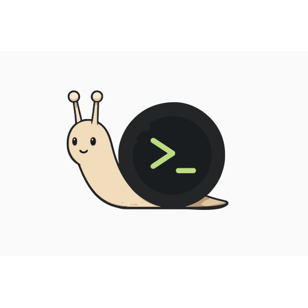

  
   
  <em>速さより、粘り強さ — 迷わない、隠さない。</em>

#  tezzer — コンセプト（日本語）

> このページは tezzer の「考え方」を日本語でまとめたものです。インストール・使い方・
> CLI の詳細は英語の [README](README.md) を参照してください。

tezzer は、永続セッションと自動再接続を備えた、**SSH のように振る舞う軽量なターミナル転送**
です。カタツムリが殻(シェル)を背負って歩くように、tezzer もセッションを持ち運びます。
接続が切れても、スリープしても、ネットワークが変わっても、殻に少し引っ込むだけ。
セッションは生き残ります。

## 一言でいうと

リモートの PTY とローカル端末をつなぐ「配線」。画面を作り直したり管理したりはしません。
出力はそのまま流し、画面の解釈は端末エミュレータに任せます。

## 基本ルール

> **raw SSH がやらないことは、tezzer もやらない。**

新機能や変更を判断するときの第一の基準です。

セキュリティも同じ考え方です。tezzer は独自の認証を導入しません。信頼は SSH から
ブートストラップされます — クライアントは SSH 転送された Unix ソケット経由で
セッション鍵を受け取り、UDP ポートはその鍵の知識を相互に証明できる相手
（鍵に pin した mTLS）しか受け付けません。tezzer のセッションに到達するには、
すでに持っている SSH アクセスがそのまま必要です。詳細は
[セキュリティモデル](docs/security-model.md)（英語）を参照してください。

## これは何か（What it is）

- 軽量な SSH ライクのターミナル転送
- PTY 出力の透過的な中継（エスケープシーケンスを書き換えない）
- `less` / `vim` / `tmux` / `screen` などフルスクリーンアプリと自然に動く
- クライアント切断後も生き続ける**永続セッション**と、ネットワーク復旧時のセッション再開
- スリープ復帰・ローミングをまたいだ自動再接続
- 暗号化 UDP 転送（AES-256-GCM・NAT 越え）＋ Unix ドメインソケットの制御チャネル
  （リモートでは SSH 経由で転送）
- トランスポートの可観測性（パケットロス・並べ替え・ローカルドロップ・RTT を「隠さず見せる」）

## これは何ではないか（What it is not）

tezzer は意図的に次を**実装しません**:

- **VT エミュレーション／画面の差分同期** — 画面の「正しさ」は端末エミュレータに委ねる。
  カーソル位置・画面内容・スクロール領域を追跡しない
- **エスケープシーケンスの解釈・書き換え・最適化**
- **ディスク永続化** — 実行中の PTY プロセスの保存は非現実的。サーバー再起動でセッションは
  失われる（systemd 等で自動再起動。tmux/screen を内側で使えば二重の永続化）
- **セッション多重化・ウィンドウ管理** — tmux/screen に任せる
- **ターミナル UI フレームワークとして振る舞うこと**
- **独自の公開鍵認証** — 認証は SSH に依存
- **マルチホスト／クラスタ** — 単一ホスト・単一バイナリ

ある機能が「端末状態の理解・再構築」を必要とするなら、それはスコープ外です。

## なぜこの方針か

`mosh` は VT エミュレータを内蔵するため tmux/screen との相性問題が多く、
`EternalTerminal` はバッファが無限に伸びてメモリ問題が報告されています。どちらも「画面を
正しく保とう」とすることに起因します。tezzer は **「正しい画面を作る」ことを目指さず、
「止まらず、戻れて、気持ちよく打てる」こと**を目指します。VT エミュレーションを捨てることで、
シンプルで堅牢な転送層に集中し、既存ツールとの高い互換性・低い CPU/メモリ・予測可能な挙動を
得ています。素通しの利得は新しい用途にもそのまま効きます — たとえばリモートで走らせた
AI エージェントが鳴らすベルや通知シーケンス（OSC 9 等）は tezzer では無変換でローカル端末に
届きます（VT エミュレータを挟む mosh では落ちることを実測済み。詳細は英語 README と
[mosh 比較](docs/mosh-comparison.md)）。

## もっと詳しく

- 設計哲学（英語）: [docs/design-philosophy.md](docs/design-philosophy.md)
- アーキテクチャ（英語）: [docs/architecture.md](docs/architecture.md)
- 設計判断の記録（ADR・英語）: [docs/adr/](docs/adr/)

---

> ⚠️ tezzer は **pre-1.0** です。ワイヤプロトコルと CLI は 1.0 まで予告なく変わり得ます。
